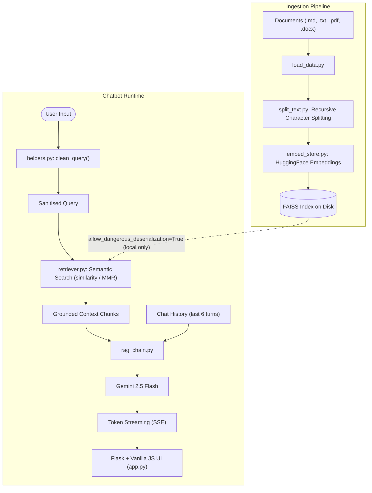

# 🍽️ Petpooja Knowledge Assistant

<div align="center">

**A production-grade Retrieval-Augmented Generation (RAG) chatbot for Petpooja's restaurant SaaS documentation.**

[](https://python.org)
[](https://langchain.com)
[](https://deepmind.google/technologies/gemini/)
[](https://faiss.ai)
[](https://flask.palletsprojects.com)
[](LICENSE)

</div>

> [!NOTE]
> This is a personal proof-of-concept project and is **not an official Petpooja product**. Built to demonstrate a full-stack RAG pipeline from document ingestion to a streaming chat UI.

---

## 📸 Screenshots

### Chat Interface
<!-- Replace this placeholder with your actual screenshot -->
> 📷 *Screenshot coming soon — run the app and capture `http://127.0.0.1:5000`*


### Source Citations
<!-- Replace this placeholder with your actual screenshot -->
> 📷 *Screenshot coming soon — shows the grounded source panel below a response*


### Dark Mode
<!-- Replace this placeholder with your actual screenshot -->
> 📷 *Screenshot coming soon — the UI in dark mode*


---

## ✨ Key Features

| Feature | Details |
|---|---|
| 🔍 **Semantic Search** | HuggingFace `all-MiniLM-L6-v2` embeddings with FAISS similarity or MMR search |
| 🤖 **Gemini 2.5 Flash LLM** | Fast, accurate, strictly context-grounded answers |
| 🌊 **True Token Streaming** | Server-Sent Events (SSE) for real-time character-by-character UI streaming |
| 🧠 **Chat Memory** | Last 6 turns of conversation injected into the prompt for contextual follow-ups |
| 📄 **Multi-format Ingest** | Loads `.md`, `.txt`, `.pdf`, and `.docx` files automatically |
| 🗂️ **Auto-categorization** | Folder name (e.g. `data/legal/`) becomes the document's category metadata tag |
| 📤 **Chat Export** | Download the full conversation as a `.txt` file |
| 🔒 **Security-first** | No credentials in code — all secrets via `.env`; no pickle deserialization |
| 🧪 **Tested** | Offline Pytest suite covers retrieval, prompts, helpers, and streaming |

---

## 🏗️ Architecture



---

## 🚀 Getting Started

### Prerequisites

- Python `3.10` or higher
- A [Google AI Studio](https://aistudio.google.com) API key for Gemini

### 1. Clone & Install

```bash
git clone https://github.com/utkarsh-aix/rag-based-petpooja-domain-assistant.git
cd rag-based-petpooja-domain-assistant
pip install -r requirements.txt
```

### 2. Configure Credentials

Copy the environment template and fill in your API key:

```bash
cp .env.example .env
```

Open `.env` and set your key:

```env
GOOGLE_API_KEY=your_actual_google_api_key_here
```

> [!CAUTION]
> **Never commit your `.env` file.** It is already listed in `.gitignore`, but always double-check before pushing.

### 3. Add Your Documents

Place your knowledge base files anywhere inside the `data/` directory. Organise them in subfolders — each subfolder name becomes the document's category tag automatically:

```
data/
├── company/
│   ├── about.md
│   └── vision_mission.md
├── legal/
│   └── privacy_policy.md
├── product/
│   ├── pricing.md
│   └── product_overview.md
└── support/
    ├── faqs.md
    └── troubleshooting.md
```

### 4. Build the Vector Store

Run the ingestion pipeline to parse documents, generate embeddings, and save the local FAISS index:

```bash
python3 -m ingest.run_ingest
```

Expected output:
```
08:00:00 [INFO] __main__ — Starting ingestion pipeline
08:00:00 [INFO] __main__ — Step 1/3 — Loading documents from 'data'
08:00:01 [INFO] __main__ — Loaded 14 document chunk(s) in total
08:00:01 [INFO] __main__ — Step 2/3 — Splitting documents into chunks
08:00:01 [INFO] __main__ — Created 47 chunk(s)
08:00:05 [INFO] __main__ — Step 3/3 — Creating embeddings and saving FAISS index
08:00:06 [INFO] __main__ — Ingestion completed successfully ✓
```

### 5. Launch the Chatbot

```bash
python3 app/app.py
```

Open your browser and navigate to **`http://127.0.0.1:5000`**.

---

## 📂 Project Structure

```
rag_application/
├── app/
│   ├── app.py                  # Flask backend — routes, SSE streaming, export
│   ├── static/
│   │   ├── css/                # Styling
│   │   └── js/                 # Chat logic, SSE client
│   └── templates/
│       └── index.html          # Single-page chat UI
│
├── chatbot/
│   ├── prompt.py               # Prompt templates (single-turn & conversational)
│   ├── rag_chain.py            # Core RAG pipeline (ask, stream, sources)
│   └── retriever.py            # Cached FAISS retriever (similarity / MMR)
│
├── config/
│   └── settings.py             # Central Settings dataclass — loads from .env
│
├── data/                       # Knowledge base (markdown, pdf, txt, docx)
│   ├── company/
│   ├── legal/
│   ├── product/
│   └── support/
│
├── ingest/
│   ├── load_data.py            # Multi-format document loader
│   ├── split_text.py           # Recursive text splitter with chunk metadata
│   ├── embed_store.py          # FAISS index builder, updater, and stats
│   └── run_ingest.py           # Pipeline entry point
│
├── screenshots/                # UI screenshots (for README)
├── tests/
│   ├── conftest.py             # Shared fixtures & mocks (fully offline)
│   └── test_chatbot.py         # Pytest suite — helpers, prompts, chain, streaming
│
├── utils/
│   └── helpers.py              # clean_query, format_sources, export_chat_to_text
│
├── vector_store/               # Auto-generated FAISS index (git-ignored)
├── .env.example                # Credential template
├── .gitignore                  # Excludes .env, vector_store/, venv/, etc.
├── requirements.txt
└── README.md
```

---

## ⚙️ Configuration Reference

All settings live in `config/settings.py` and are loaded from the `.env` file at startup. No hardcoded defaults contain real credentials.

| Setting | Default | Description |
|---|---|---|
| `GOOGLE_API_KEY` | *(from .env)* | Google Gemini authentication key |
| `VECTOR_STORE_PATH` | `vector_store/faiss_index` | Directory where the FAISS index is saved |
| `DATA_DIR` | `data` | Root directory scanned during ingestion |
| `EMBEDDING_MODEL` | `sentence-transformers/all-MiniLM-L6-v2` | HuggingFace embedding model |
| `LLM_MODEL` | `gemini-2.5-flash` | Gemini model used for generation |
| `LLM_TEMPERATURE` | `0` | Sampling temperature (`0` = deterministic) |
| `TOP_K_RETRIEVAL` | `4` | Number of document chunks retrieved per query |
| `CHUNK_SIZE` | `800` | Max characters per text chunk |
| `CHUNK_OVERLAP` | `150` | Overlap between consecutive chunks |

---

## 📄 Managing the Knowledge Base

To update or expand the assistant's knowledge:

1. **Add documents** — Drop `.md`, `.txt`, `.pdf`, or `.docx` files anywhere under `data/`. Use subfolders to auto-tag categories.

2. **Re-run ingestion** — Rebuild (or incrementally update) the FAISS index:
   ```bash
   python3 -m ingest.run_ingest
   ```

3. **Restart the app** — The retriever will load the fresh index on the next request. No manual cache clearing needed.

> [!TIP]
> Use `ingest/embed_store.py`'s `update_vector_store()` function programmatically to **incrementally add** new documents to an existing index without a full rebuild.

---

## 🧪 Running Tests

The test suite is fully **offline** — it mocks the LLM and FAISS index so no API key or vector store is needed:

```bash
pytest tests/ -v
```

Expected output:
```
tests/test_chatbot.py::test_clean_query_strips_whitespace        PASSED
tests/test_chatbot.py::test_clean_query_removes_injection_chars  PASSED
tests/test_chatbot.py::test_format_sources_empty                 PASSED
tests/test_chatbot.py::test_format_sources_multiple              PASSED
tests/test_chatbot.py::test_truncate_text_under_limit            PASSED
tests/test_chatbot.py::test_stream_question_yields_tokens        PASSED
...
```

---

## ⚠️ Known Limitations

- **Strict Grounding** — The prompt instructs the model to only answer from the retrieved context. Queries unrelated to the knowledge base return: *"Sorry, this information is not available in the company knowledge base."*
- **CPU-only Embeddings** — PyTorch falls back to CPU if no CUDA GPU is available. Ingestion still works but is slower on very large document sets.
- **Local FAISS** — The vector index lives on the local filesystem. For production scale, migrate to a hosted vector DB such as [Pinecone](https://pinecone.io), [Qdrant](https://qdrant.tech), or [pgvector](https://github.com/pgvector/pgvector).
- **Single-user Flask Server** — The dev server (`debug=True`) is not production-grade. Use `gunicorn` with multiple workers for concurrent users.

---

## 🛠️ Tech Stack

| Layer | Technology | Version |
|---|---|---|
| **Language** | Python | `3.10+` |
| **LLM** | Google Gemini 2.5 Flash | via `langchain-google-genai` |
| **Embeddings** | `sentence-transformers/all-MiniLM-L6-v2` | `sentence-transformers==5.4.0` |
| **Vector Store** | FAISS (CPU) | `faiss-cpu==1.13.2` |
| **RAG Framework** | LangChain | `langchain==1.2.0` |
| **Web Backend** | Flask | `flask==3.0.3` |
| **Document Loaders** | PyPDF, python-docx | `pypdf==6.4.0`, `python-docx==1.2.0` |
| **Config** | python-dotenv | `python-dotenv==1.2.2` |
| **Testing** | Pytest | `pytest==9.0.2` |

---

## 🔒 Security Notes

- All API keys are loaded exclusively from the `.env` file — never hardcoded.
- `vector_store/`, `.env`, `venv/`, and runtime outputs are all listed in `.gitignore`.
- Pickle deserialization (`allow_dangerous_deserialization=True`) is used **only for the locally generated FAISS index** — never for untrusted external files.
- User queries are sanitized by `clean_query()` before reaching the LLM (strips null bytes, template injection characters `{}`, and backticks).

---

## 📬 Contact

**Utkarsh Raj** — [GitHub @utkarsh-aix](https://github.com/utkarsh-aix)

---

<div align="center">
  <sub>Built with ❤️ using LangChain, Google Gemini, and FAISS</sub>
</div>
