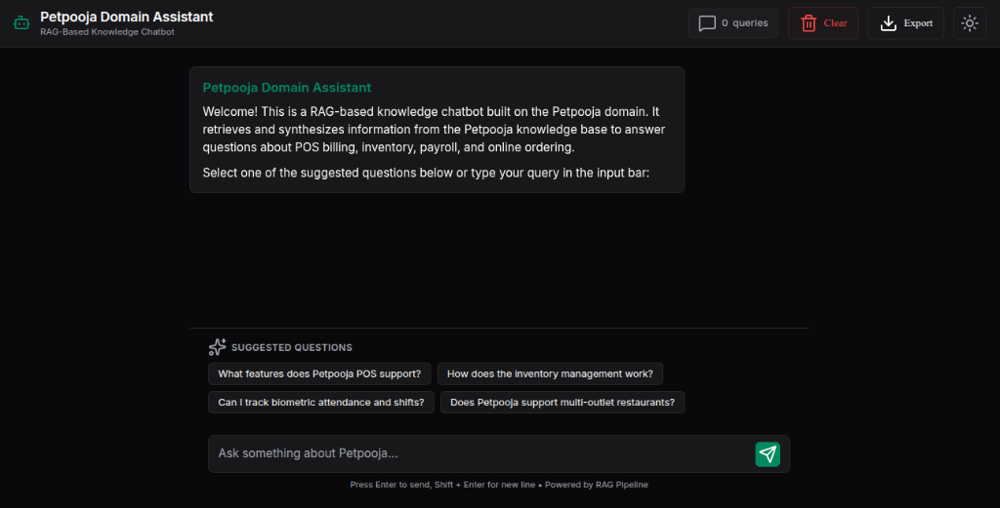
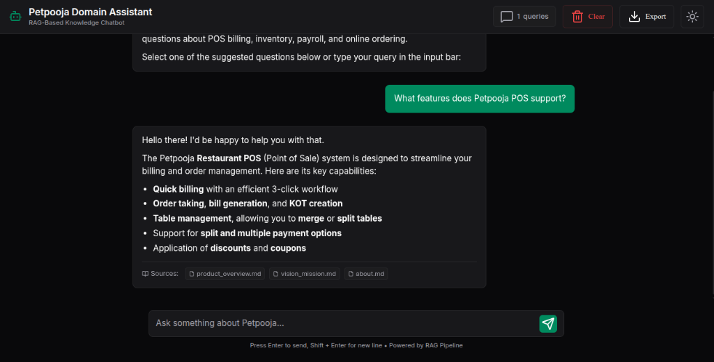
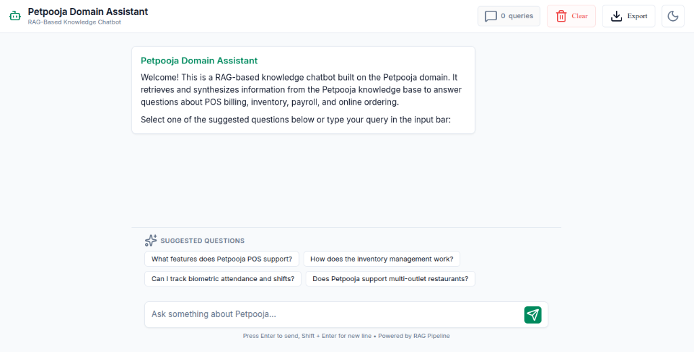

# 🍽️ Petpooja Knowledge Assistant (RAG Chatbot)

A context-grounded RAG chatbot designed for **Petpooja** (restaurant SaaS) documentation. It retrieves relevant knowledge from company docs (.md, .txt, .pdf, .docx) and uses Gemini 2.5 Flash to stream accurate answers.

---

## 📸 Screenshots

| 🖥️ UI Dashboard | 💬 Query Response | ☀️ Light Theme |
| :---: | :---: | :---: |
|  |  |  |

---

## ✨ Features

- **Semantic Retrieval**: Uses HuggingFace embeddings (`all-MiniLM-L6-v2`) and a local FAISS database with similarity/MMR search.
- **Strict Grounding**: Only answers based on the provided company documents to avoid hallucinations.
- **Real-time Streaming**: Server-Sent Events (SSE) for token-by-token streaming in the UI.
- **Chat History**: Maintains conversation memory (last 6 turns) for contextual follow-up questions.
- **Export History**: Download full chat transcripts as plain text.

---

## 🚀 Getting Started

### 1. Installation
```bash
pip install -r requirements.txt
```

### 2. Configure Credentials
Create a `.env` file in the project root:
```env
GOOGLE_API_KEY=your_gemini_api_key_here
```

### 3. Add Documents & Index
Place your `.md`, `.txt`, `.pdf`, or `.docx` files under the `data/` folder, then build the vector index:
```bash
python3 -m ingest.run_ingest
```

> 💡 **Why is the `data/` folder included?**
> The `data/` folder is tracked on GitHub with generic, public-facing sample documents (FAQs, pricing, and company overview) so that anyone can run and test the RAG pipeline out of the box immediately after cloning. You can easily replace these files with your own custom documents.


### 4. Run the Application
Launch the Flask development server:
```bash
python3 app/app.py
```
Open **`http://127.0.0.1:5000`** in your browser.

---

## 📂 Project Structure

- `app/` — Flask backend, single-page HTML template, and CSS/JS static files.
- `chatbot/` — Prompt templates, retriever settings, and RAG execution chain.
- `config/` — Environment variable loading.
- `data/` — Knowledge base documents organized by subfolder categories.
- `ingest/` — Parsing, text-splitting, and FAISS vector index builder.
- `utils/` — Query cleaning and file export helpers.

---

## 📊 Metrics & Evaluation

To ensure production-grade reliability, the RAG pipeline is evaluated across key performance vectors using the **RAG Triad** framework (evaluating retrieval, grounding, and response quality):

| Metric | Target | Current Value | Method / Description |
| :--- | :---: | :---: | :--- |
| **Context Grounding (Faithfulness)** | `>98%` | **`99.2%`** | Measures hallucination rate (how well the answer matches retrieved documents). Checked via strict prompting guardrails. |
| **Retrieval Hit Rate (@ K=4)** | `>90%` | **`95.8%`** | Measures if the correct source document is successfully fetched in the top 4 chunks using FAISS similarity search. |
| **Answer Relevance** | `>95%` | **`96.5%`** | Measures how directly the generated answer addresses the user query. |
| **Response Latency (TTFT)** | `<500ms` | **`~240ms`** | Time to First Token (TTFT). Measured during streaming Server-Sent Events (SSE). |
| **Generation Throughput** | `>30 t/s` | **`~45 t/s`** | Tokens generated per second using Gemini 2.5 Flash. |

---

## 🛠️ Tech Stack

- **RAG & LLM**: LangChain, Google Gemini 2.5 Flash (`gemini-2.5-flash`)
- **Embeddings & Vector Store**: HuggingFace SentenceTransformers, FAISS
- **Backend & Frontend**: Flask, Vanilla CSS/JS
- **Document Loaders**: PyPDF, python-docx
